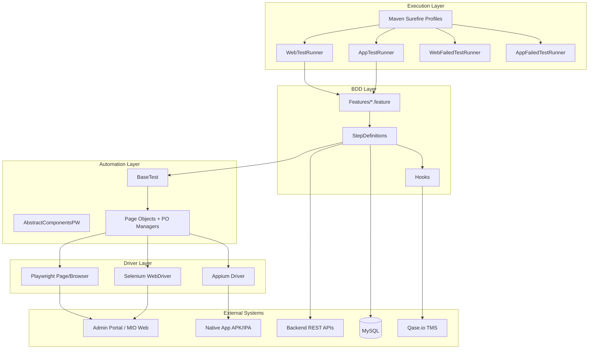
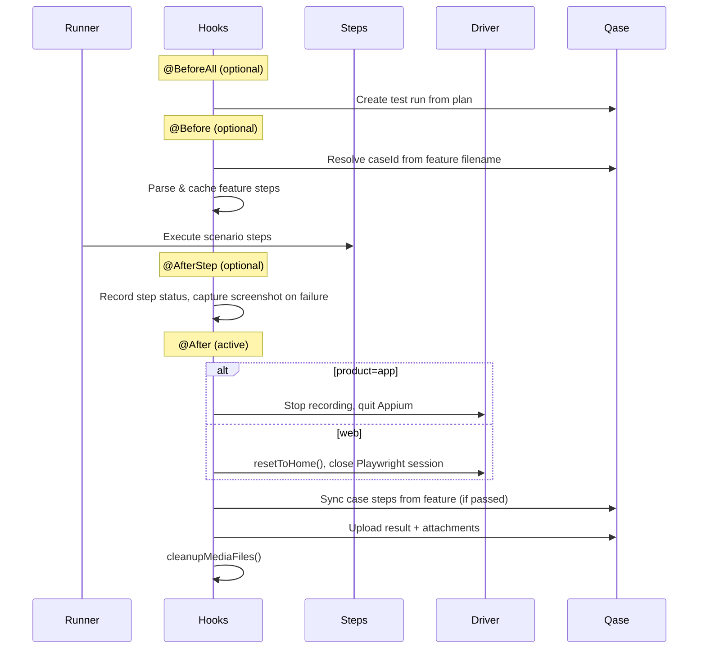

# EFSG_auto — Architecture

This document describes the architecture of **EFSG_auto**, a multi-product test automation framework for EFSG applications. It covers web (Admin Portal, MIO), native mobile, API, and database validation, with optional Qase TMS integration.

---

## 1. Overview

| Aspect | Detail |
|--------|--------|
| **Language** | Java 21 |
| **Build** | Maven |
| **BDD** | Cucumber 7 + Gherkin feature files |
| **Test runner** | TestNG (via `AbstractTestNGCucumberTests`) |
| **Web automation** | Playwright (primary), Selenium (legacy) |
| **Mobile automation** | Appium (Android / iOS) |
| **TMS** | Qase.io REST API |
| **Reporting** | Cucumber JSON/HTML, ExtentReports, Qase run results |

The framework follows a **layered BDD design**: feature files express behavior, step definitions orchestrate flows, page objects encapsulate UI interactions, and shared utilities handle drivers, config, and reporting.

---

## 2. High-Level Architecture



---

## 3. Repository Structure

```
EFSG_auto/
├── pom.xml                          # Maven build, profiles, dependencies
├── testng.xml                       # Legacy TestNG suite (Regression profile)
├── AGENTS.md                        # Agent index (web / app / API guides)
├── AGENTS-WEB.md                    # Web automation agent rules
├── AGENTS-APP.md                    # App automation agent rules
├── AGENTS-API.md                    # API automation agent rules
├── src/
│   ├── main/
│   │   ├── java/
│   │   │   ├── AbstractComponent/   # Shared UI helpers (PW, Selenium, Mobile)
│   │   │   ├── DataResources/       # Properties, ExtentReports config
│   │   │   ├── PageObject/          # Page Object Model classes
│   │   │   └── utils/               # BaseTest, Qase clients, mobile helpers
│   │   └── resources/               # APK/IPA binaries for mobile tests
│   └── test/
│       └── java/
│           ├── API/                 # ApiClient, CoreService
│           ├── CucumberRunner/      # TestNG + Cucumber entry points
│           ├── Data/                # Test data, Qase config, SQL helpers
│           ├── Features/            # Gherkin feature files (~269)
│           └── StepDefinitions/     # Cucumber glue code
├── screenshots/                     # Playwright failure screenshots
├── videos/                        # Playwright session recordings
├── app_videos/                    # Appium screen recordings
└── target/                        # Build output, Cucumber reports, rerun files
```

---

## 4. Products and Module Mapping

The framework supports three products, selected at runtime via `-Dproduct=...` or `GlobalData.properties`.

| Product | Value | Page Object Package | PO Manager | Qase Project | Feature Prefix |
|---------|-------|---------------------|------------|--------------|----------------|
| Admin Portal | `adminPortal` | `PageObject.AdminPortalPW` | `AOPOManager` | `AP` | `AP-<id>.feature` |
| MIO Admin | `mio` | `PageObject.MIOadmin` | `MIOPOManager` | `MIO` | `MIO-<id>.feature` |
| Native App | `app` | `PageObject.NativeApp` | `AppPOManager` | `APP` | `APP-<id>.feature` |

### Feature file organization

```
src/test/java/Features/
├── AdminPortal/
│   ├── login/
│   ├── aoApplication/
│   ├── cm/
│   ├── aoBlacklist/
│   ├── aoUserManagement/
│   └── aoRolesPermission/
├── MIO/
│   └── login/
└── NativeApp/
    ├── trade/
    ├── aoApplication/
    └── onboarding/
```

Feature files are named after Qase case IDs (e.g. `AP-141.feature` maps to Qase case `141` in project `AP`).

---

## 5. Test Execution Model

### 5.1 Cucumber runners

All runners live in `src/test/java/CucumberRunner/` and share:

- `features = "src/test/java/Features"`
- `glue = "StepDefinitions"`
- `tags = "@Test"` (primary filter for runnable scenarios)

| Runner | Profile | Purpose |
|--------|---------|---------|
| `WebTestRunner` | `WebTests` | Main web suite (Admin Portal + MIO) |
| `AppTestRunner` | `AppTests` | Main mobile suite |
| `WebFailedTestRunner` | `WebFailedTests` | Rerun failed web scenarios |
| `AppFailedTestRunner` | — | Rerun failed app scenarios |

Runners emit:

- JSON report → `target/cucumber-reports/cucumber-report.json`
- Rerun file → `target/web_failed_scenarios.txt` or `target/app_failed_scenarios.txt`

### 5.2 Maven profiles

Defined in `pom.xml`:

| Profile | Surefire includes | Notes |
|---------|-------------------|-------|
| `WebTests` | `**/*WebTestRunner.java` | Parallel methods, unlimited threads |
| `AppTests` | `**/*AppTestRunner.java` | Parallel methods, unlimited threads |
| `WebFailedTests` | `**/*WebFailedTestRunner.java` | Reads rerun file |
| `Regression` | `testng.xml` | Legacy non-Cucumber suite |

### 5.3 Typical run commands

```bash
# Admin Portal (headed Chrome)
mvn test -PWebTests -Dproduct=adminPortal -Denv=bauuat -Dentity=EBL_MT5 -Dbrowser=chrome

# MIO Admin
mvn test -PWebTests -Dproduct=mio -Denv=mt5uat -Dbrowser=chrome

# Native App (Android)
mvn test -PAppTests -Dproduct=app -Denv=mt5uat -Dentity=EBL_MT5 -Dplatform=ANDROID

# Rerun failed web tests
mvn test -PWebFailedTests -Dproduct=adminPortal -Denv=bauuat -Dentity=EBL_MT5 -Dbrowser=chrome
```

### 5.4 Configuration precedence

System properties (`-Dkey=value`) override values in property files. Key runtime parameters:

| Parameter | Source | Example values |
|-----------|--------|----------------|
| `product` | `GlobalData.properties` | `adminPortal`, `mio`, `app` |
| `env` | `GlobalData.properties` | `bauuat`, `mt5uat`, `bausit` |
| `entity` | `GlobalData.properties` | `EBL_MT5`, `EIEHK`, `XPro`, `EGM` |
| `browser` | `GlobalData.properties` | `chrome`, `firefox`, `edge`, `webkit` |
| `platform` | `qase-nativeApp.properties` | `ANDROID`, `IOS` |

---

## 6. Layered Design

### 6.1 Feature layer

Gherkin scenarios describe user-visible behavior. Tags control scope:

- `@Test` — included by default runners
- `@Regression`, `@Smoke` — suite grouping
- `@EBL_MT5`, `@EIEHK` — entity-specific filtering
- Module tags — `@CM`, `@AdminPortal`, etc.

Example (`AP-141.feature`):

```gherkin
@Regression @Smoke @AdminPortal @CM @EBL_MT5 @Test
Scenario: CM status in Pending Verification after submit changes
  Given the user logged in to Admin Portal as username "aoadmin01" and password "P@ssw0rd!"
  And the user clicks "Customer Management" on the ao admin portal menu
  ...
```

### 6.2 Step definition layer

Located in `src/test/java/StepDefinitions/`, organized by product and module:

| Package | Responsibility |
|---------|----------------|
| `AdminPortal/login/` | Admin Portal login |
| `AdminPortal/aoApplicationSteps/` | Account opening flows |
| `AdminPortal/cm/` | Customer management |
| `AdminPortal/aoBlacklistSteps/` | Blacklist |
| `AdminPortal/aoUserManagementSteps/` | User management |
| `AdminPortal/aoRolesPermissionSteps/` | Roles & permissions |
| `MIO/login/` | MIO login |
| `MIO/transactionManagement/` | Deposits / transactions |
| `NativeApp/login/`, `aoSteps/`, `tradeSteps/`, `common/` | Mobile flows |
| `Backend/` | API + SQL assertions |
| `Background/` | DB preconditions |
| `Hooks` | Lifecycle, Qase, media cleanup |

**Pattern:** step classes extend `BaseTest`, initialize the driver/page in a `@Given` hook step, then delegate to the appropriate PO manager.

```java
page = initializePage();
aopoManager = new AOPOManager(page);
aopoManager.getAdminLoginPage().fillCredential(username, password);
```

### 6.3 Page Object layer

#### Playwright (current web standard)

- Package: `PageObject.AdminPortalPW`, `PageObject.MIOadmin`
- Each page class accepts `com.microsoft.playwright.Page`
- Locators use Playwright APIs (`getByRole`, `getByLabel`, `Locator`)
- Assertions via `PlaywrightAssertions.assertThat(...)`

#### PO Managers

Centralize page object creation and provide typed accessors:

| Manager | Path | Pages |
|---------|------|-------|
| `AOPOManager` | `AdminPortalPW/AOPOManager.java` | Login, AO application, CM, blacklist, user mgmt, roles |
| `MIOPOManager` | `MIOadmin/MIOPOManager.java` | Login, dashboard, deposit management |
| `AppPOManager` | `NativeApp/AppPOManager.java` | 17+ mobile screens (login, trade, portfolio, etc.) |

Step definitions should access pages only through the manager for the active product.

#### Legacy Selenium

- Package: `PageObject.AdminPortal`
- Uses `WebDriver` + PageFactory `@FindBy`
- `APPageObjectManager` wraps legacy login page
- Some step definitions still reference both stacks during migration

#### Mobile (Appium)

- Package: `PageObject.NativeApp`
- Pages accept `AppiumDriver`
- Gestures and waits via `MobileAbstractComponents`

### 6.4 Shared components

| Class | Path | Role |
|-------|------|------|
| `BaseTest` | `utils/BaseTest.java` | Driver init, domain routing, screenshots, video, config |
| `AbstractComponentsPW` | `AbstractComponent/AbstractComponentsPW.java` | Test data generation, form helpers, API domain resolution |
| `AbstractComponents` | `AbstractComponent/AbstractComponents.java` | Legacy Selenium helpers |
| `MobileAbstractComponents` | `AbstractComponent/MobileAbstractComponents.java` | Appium gestures/waits |
| `SetCondition` | `utils/SetCondition.java` | Scenario condition flags (e.g. under-18, expired ID) |

---

## 7. Driver Initialization

### 7.1 Playwright (web)

`BaseTest.initializePage()`:

1. Reads `product`, `browser`, `env`, `entity` from config
2. Launches Chromium/Firefox/WebKit/Edge via Playwright
3. Enables video recording (`recordPlaywrightVideo()`)
4. Navigates to environment URL from `setDomain(env, product, entity)`
5. Waits for `NETWORKIDLE`

Supported browsers: `chrome`, `firefox`, `webkit`, `edge` (including headless variants).

### 7.2 Selenium (legacy)

`BaseTest.initializeDriver()` — used by older flows and mobile entry when `product=app` is not set for web. Supports Chrome, Firefox, Edge via WebDriverManager.

### 7.3 Appium (mobile)

When `product=app`:

1. `MobilePlatform` resolves `ANDROID` or `IOS`
2. `AppConfig` selects APK path and package by `entity` + `env`
3. `MobileDriver` starts Appium server (port 4723) and creates `UiAutomator2Options` / XCUITest session
4. Screen recording starts via `CanRecordScreen`

APK/IPA binaries live under `src/main/resources/`.

---

## 8. Hooks and Scenario Lifecycle

`StepDefinitions/Hooks.java` extends `BaseTest` and manages per-scenario lifecycle.



### Active vs optional hooks

| Hook | Status | Behavior |
|------|--------|----------|
| `@After` | **Active** | Driver cleanup, media file deletion |
| `@BeforeAll` | Commented | Qase test run creation |
| `@Before` | Commented | Case ID resolution, step cache init |
| `@AfterStep` | Commented | Per-step Qase payload, failure screenshots |
| `syncCaseStepsWithFeatureFile` | Commented in `@After` | Sync Qase case steps from feature file |
| `reportTestResult` | Commented in `@After` | Post results and attachments to Qase |

Qase integration is fully implemented but gated behind commented annotations. Uncomment the relevant hooks to enable TMS reporting and step sync.

### Step sync behavior (when enabled)

When `syncCaseStepsWithFeatureFile` is active:

1. Parse steps from the current scenario in the `.feature` file
2. Fetch existing steps from the Qase test case
3. If different **and scenario passed**, PATCH Qase case steps with feature-file text
4. If any step failed, skip replacement (preserve existing Qase steps)
5. Step result payloads use feature-file text (not Qase-fetched text) to avoid overwriting synced steps

---

## 9. Qase TMS Integration

### 9.1 Configuration chain

```
GlobalData.properties (product, entity, env)
        ↓
QASEConfig (src/test/java/Data/QASEConfig.java)
        ↓
Product-specific qase-*.properties
        ↓
QaseApiClientOptimized (src/main/java/utils/QaseApiClientOptimized.java)
```

| Properties file | Product |
|-----------------|---------|
| `qase-adminportal.properties` | Admin Portal (`AP`) |
| `qase-mioAdminPortal.properties` | MIO (`MIO`) |
| `qase-nativeApp.properties` | Native App (`APP`) |

Each file contains API token, project code, test type, and entity-specific test plan IDs.

### 9.2 Case ID resolution

Feature filename convention: `<projectCode>-<caseId>.feature`

Example: `AP-141.feature` in project `AP` → case ID `141`.

### 9.3 API operations

| Operation | Method | Endpoint |
|-----------|--------|----------|
| Create test run | POST | `/v1/run/{projectCode}` |
| Get test plan title | GET | `/v1/plan/{projectCode}/{planId}` |
| Get case steps | GET | `/v1/case/{projectCode}/{caseId}` |
| Update case steps | PATCH | `/v1/case/{projectCode}/{caseId}` |
| Upload attachment | POST | `/v1/attachment/{projectCode}` |
| Post result | POST | `/v1/result/{projectCode}/{runId}` |

`QaseApiClient.java` (legacy) is retained for reference; `QASEConfig` delegates to `QaseApiClientOptimized`.

---

## 10. API and Backend Validation

### 10.1 API client

`src/test/java/API/ApiClient.java` — thin wrapper around Playwright `APIRequestContext`:

- `get(url, token)` / `post(url, token, body)`
- Bearer token via `Authorization` header
- Implements `AutoCloseable`

### 10.2 Core service

`src/test/java/API/CoreService.java` — business-level API orchestration:

- Resolves API domain from `AbstractComponentsPW.getApiEndpointDomain(env)`
- Account opening status, customer management pagination, referral code lookups
- JSON parsing via Gson (`response.content[]` patterns)
- Static filters: `clientType`, `status`

Used from `BackendSteps` and login flows that validate API state alongside UI.

### 10.3 Database validation

`src/test/java/Data/SQLDatabase.java` — MySQL queries for post-condition checks.

`BackendSteps` combines:

1. UI state (e.g. email from page object)
2. API token from Playwright `localStorage` (`BaseTest.retrieveLocalStorageVal()`)
3. SQL assertions against CM/AO tables

---

## 11. Test Data and Configuration Files

| File | Location | Purpose |
|------|----------|---------|
| `GlobalData.properties` | `DataResources/` | Default product, env, entity, browser |
| `FileDirectory.properties` | `DataResources/` | Selenium Grid video path |
| `TradeSymbol.properties` | `DataResources/` | Trading symbol config (native app) |
| `qase-*.properties` | `DataResources/` | Qase API tokens, plan IDs |
| `Crendential.json` | `test/java/Data/` | Web login credentials |
| `AppCredential.java` | `test/java/Data/` | Entity-scoped app credentials |
| `AoAccountCreation.java` | `test/java/Data/` | AO test data builders |
| `CmAccountStatus.java` | `test/java/Data/` | CM status constants |

`AbstractComponentsPW.userinfoList()` generates randomized emails, phone numbers, and entity-scoped test data at runtime.

---

## 12. Reporting and Artifacts

| Artifact | Location | Trigger |
|----------|----------|---------|
| Cucumber JSON | `target/cucumber-reports/` | Runner plugin |
| Cucumber HTML | `target/cucumber-html-reports/` | `maven-cucumber-reporting` plugin |
| Playwright video | `videos/` | Browser context video recording |
| Playwright screenshot | `screenshots/` | Failed step in `@AfterStep` |
| Appium video | `app_videos/` | `CanRecordScreen` stop |
| Rerun file | `target/*_failed_scenarios.txt` | Cucumber rerun plugin |
| Qase attachments | Qase cloud | Screenshot/video hash upload |
| ExtentReports | Via `ExtendReporterNG` | Legacy reporting setup |

Media cleanup is controlled by `removeVideoFlag` and `removeScreenShotFlag` in `Hooks`.

---

## 13. Environment and URL Routing

`BaseTest.setDomain(env, product, entity)` maps runtime config to application URLs:

### Admin Portal

| Environment | URL |
|-------------|-----|
| `bausit` | `https://d13ckj22o5rgah.cloudfront.net/login` |
| `bauuat` | `https://bau-uat-aocm-ap.empfs.net/login` |
| `mt5sit` | `https://d3lyp6p86bdjbb.cloudfront.net/login` |
| `mt5uat` | `https://uat-aocm-ap.empfs.net/login` |
| `egmuat` | `https://uat-aocm-ap.empfs.net/login` |

### MIO Admin

| Environment | URL |
|-------------|-----|
| `bausit` / `bauuat` | `https://d27ekljjcs6mcs.cloudfront.net/login` |
| `mt5uat` | `https://uat-mt5mio-ap.empfs.net/login` |

API domains are resolved separately in `AbstractComponentsPW` and `CoreService.getCrmDomain()`.

---

## 14. Naming Conventions

| Element | Convention | Example |
|---------|------------|---------|
| Feature file | `<QaseProject>-<CaseId>.feature` | `AP-141.feature` |
| Feature folder | Product / module | `Features/AdminPortal/cm/` |
| Step definition class | `<Module>Steps.java` | `CMSteps.java` |
| Page object (Playwright) | `<PageName>PagePW.java` or descriptive name | `AdminLoginPagePW.java` |
| PO manager | `<Product>POManager` | `AOPOManager` |
| Cucumber step text | Natural language, reusable | `the user clicks {string} on the menu` |

---

## 15. Migration State

The project is actively migrating from Selenium to Playwright for web tests.

| Stack | Status | Package |
|-------|--------|---------|
| Playwright | **Current standard** | `AdminPortalPW`, `MIOadmin` |
| Selenium | Legacy, partially referenced | `AdminPortal` |
| Appium | Active for mobile | `NativeApp` |

New web tests should use Playwright page objects and `AOPOManager` / `MIOPOManager`. Avoid adding new Selenium page objects unless required for compatibility.

---

## 16. Adding a New Test (Extension Guide)

1. **Create feature file** under the correct product/module folder, named `<ProjectCode>-<QaseId>.feature`, tagged with `@Test`.
2. **Check existing step definitions** — reuse exact step text bindings where possible.
3. **Add new steps** in the matching `StepDefinitions/<product>/` package if needed.
4. **Implement page object methods** in the product-mapped PO package.
5. **Register new page classes** in the PO manager (`AOPOManager`, `MIOPOManager`, or `AppPOManager`).
6. **Use `initializePage()`** (web) or mobile driver init (app) in the first step.
7. **Add assertions** — prefer Playwright `assertThat` for web.
8. **Run** with the appropriate Maven profile and `-D` overrides.

See `AGENTS.md` (index) and the specialized guides `AGENTS-WEB.md`, `AGENTS-APP.md`, `AGENTS-API.md` for agent-specific generation rules.

---

## 17. Key Dependencies

| Library | Version | Usage |
|---------|---------|-------|
| Java | 21 | Language runtime |
| Cucumber | 7.20.1 | BDD framework |
| TestNG | 7.10.2 | Test runner |
| Playwright | 1.53.0 | Web automation |
| Selenium | 4.28.1 | Legacy web |
| Appium Java Client | 9.4.0 | Mobile automation |
| Qase API | 3.2.1 | TMS client (plus custom HTTP client) |
| Jackson / Gson | 2.x | JSON serialization |
| Apache HttpClient 5 | 5.4.1 | HTTP (Qase legacy client) |
| MySQL Connector | 8.0.33 | Database validation |
| ExtentReports | 5.1.2 | HTML reporting |
| WebDriverManager | 5.9.2 | Selenium driver management |

---

## 18. Related Documentation

| Document | Purpose |
|----------|---------|
| `AGENTS.md` | Agent index — links to web, app, and API guides |
| `AGENTS-WEB.md` | Web UI automation rules (Playwright) |
| `AGENTS-APP.md` | Mobile app automation rules (Appium) |
| `AGENTS-API.md` | API and backend validation rules |
| `STANDARD_PROMPT_TEMPLATE.md` | Prompt template for new test cases |
| `generated-prompts/` | Reference prompts for generated scenarios |
| `README.md` | Local setup (Java, Maven, Docker) |
