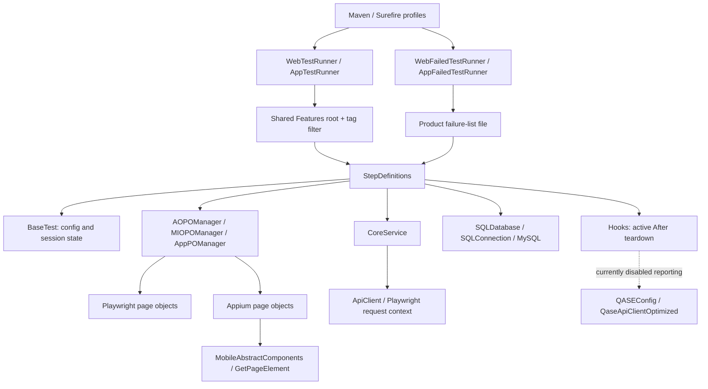

# EFSG_auto — Architecture

Reviewed against the **local working tree on 2026-09-21**, including in-progress source changes. This document describes the implemented framework and separates active behavior from optional or incomplete paths. It is not a record of a successful full-suite run. Agent execution and change rules are in [AGENTS.md](AGENTS.md).

## 1. System overview

EFSG_auto is a Java 21/Maven test automation project for Admin Portal, MIO Admin, and native trading applications. Gherkin features express behavior; Cucumber/TestNG runners discover scenarios; step definitions coordinate page objects, API services, and database checks.

The current web stack is Playwright Java. Legacy Selenium classes remain. Native automation uses Appium Java with UiAutomator2 or XCUITest. Qase reporting is implemented through a custom HTTP client but is disabled in the current hook wiring.


```mermaid
flowchart TD
    Maven["Maven / Surefire profiles"] --> Normal["WebTestRunner / AppTestRunner"]
    Maven --> Rerun["WebFailedTestRunner / AppFailedTestRunner"]
    Normal --> Features["Shared Features root + tag filter"]
    Rerun --> Failed["Product failure-list file"]
    Features --> Glue["StepDefinitions"]
    Failed --> Glue
    Glue --> Base["BaseTest: config and session state"]
    Glue --> Managers["AOPOManager / MIOPOManager / AppPOManager"]
    Managers --> Web["Playwright page objects"]
    Managers --> Mobile["Appium page objects"]
    Mobile --> Helpers["MobileAbstractComponents / GetPageElement"]
    Glue --> Core["CoreService"]
    Core --> HTTP["ApiClient / Playwright request context"]
    Glue --> SQL["SQLDatabase / SQLConnection / MySQL"]
    Glue --> Hooks["Hooks: active After teardown"]
    Hooks -. "currently disabled reporting" .-> Qase["QASEConfig / QaseApiClientOptimized"]
```

Appium MCP is a separate interactive inspection path. Its managed sessions are not shared automatically with `BaseTest` or the Java runners.

### Agent coordination

[AGENTS.md](AGENTS.md) supplies shared project policy and routes the primary agent to [AGENTS-ORCHESTRATOR.md](AGENTS-ORCHESTRATOR.md). The orchestrator owns planning, specialist assignments, shared-file changes, integration review, and execution authorization tracking. Named definitions in [.codex/agents](.codex/agents) provide `efsg-orchestrator` and three specialists: `efsg-web`, `efsg-app`, and `efsg-api`, each reading its existing domain guide.

Independent inspection or edits to separately owned files may be delegated concurrently. Framework files, Cucumber glue contracts, and each browser/device session require coordinated ownership. Test execution remains subject to explicit approval and the framework's static-state limitations. These agent definitions do not change Maven runners, configure MCP servers, or start agents by themselves; the active client must support delegation. The root guide also describes a sequential fallback.

## 2. Repository map

```text
EFSG_auto/
├── pom.xml                         Maven dependencies and five profiles
├── testng.xml                      Legacy non-Cucumber suite
├── .codex/agents/                  Orchestrator and web/app/API agent definitions
├── AGENTS*.md                      Shared, orchestration, and domain-specific rules
├── ARCHITECTURE.md                  This implementation map
├── STANDARD_PROMPT_TEMPLATE.md      Web-oriented generation request template
├── package.json / package-lock.json Auxiliary WebdriverIO / Appium MCP dependencies
├── capabilities.json               Local Android capability example
├── wdio.conf.js                    Incomplete WebdriverIO base configuration
├── wdio.android.conf.ts            Local Android override example
├── src/main/java/
│   ├── AbstractComponent/          Playwright, mobile, and legacy Selenium helpers
│   ├── DataResources/              Properties and ExtentReports configuration
│   ├── PageObject/
│   │   ├── AdminPortalPW/          Current Admin Portal pages and AOPOManager
│   │   ├── MIOadmin/               MIO pages and MIOPOManager
│   │   ├── NativeApp/              Appium pages and AppPOManager
│   │   └── AdminPortal/            Legacy Selenium pages
│   └── utils/                      BaseTest, extraction, reporting, SQL, and app drivers
├── src/main/resources/             Android archive, CopyMaster.app, legacy Grid compose
├── src/test/java/
│   ├── API/                        ApiClient and CoreService
│   ├── CucumberRunner/             Four Cucumber/TestNG runners
│   ├── Data/                       Trading/AO data, SQLDatabase, GlobalConfig, QASEConfig
│   ├── Features/                   Product/module Gherkin files
│   └── StepDefinitions/            Product bindings, backend bindings, Hooks
├── screenshots/                    Captured images when capture paths are invoked
├── videos/                         Playwright recordings
├── app_videos/                     Native screen recordings
├── reports/                        Legacy ExtentReports output
└── target/                         Build output, Cucumber JSON, rerun lists, extracted APK
```

The reviewed source tree contains **98 Java files and 307 feature files**: 151 Admin Portal, 3 MIO, and 153 NativeApp. These are file counts, not passing-test counts. The feature inventory has no `Background`, `Scenario Outline`, or `Examples` sections at this review date.

`generated-prompts/` is required when agents generate new cases; it is not produced by the runtime and is absent until created. `target/` is ignored for new files, although some output files are already tracked. Preserve existing user changes and evidence in these directories.

## 3. Product, modules, and managers

| Product | Config value | Manager | Feature/Qase prefix | Modules |
|---|---|---|---|---|
| Admin Portal | `adminPortal` | `AOPOManager` | `AP` | login, aoApplication, cm, aoBlacklist, aoUserManagement, aoRolesPermission |
| MIO Admin | `mio` | `MIOPOManager` | `MIO` | login, depositManagement |
| Native app | `app` | `AppPOManager` | `APP` | onboarding, aoApplication, trade |

[AOPOManager](src/main/java/PageObject/AdminPortalPW/AOPOManager.java) constructs 19 page instances covering login/menu, individual/company account opening, customer-management forms, blacklist, users, and roles. [MIOPOManager](src/main/java/PageObject/MIOadmin/MIOPOManager.java) constructs login, dashboard, and deposit-management pages. [AppPOManager](src/main/java/PageObject/NativeApp/AppPOManager.java) constructs 17 page/helper instances covering onboarding/login, navigation, trading, order/position details, and settings.

Managers eagerly instantiate their pages and expose typed getters. Step definitions should use the relevant manager. Existing native page methods also construct some pages internally. `BiometricsPage` exists outside AppPOManager's getter set.

Shared state is concentrated in static fields: `BaseTest` drivers/configuration/captured values, product login managers, native trading pages, and API filters. This is not a dependency-injected, scenario-scoped design.

## 4. Build and execution

### Runners and profiles

Source: [pom.xml](pom.xml) and [CucumberRunner](src/test/java/CucumberRunner).

| Profile | Surefire selection | Cucumber feature source | Annotation tags |
|---|---|---|---|
| `WebTests` | `**/*WebTestRunner.java` | `src/test/java/Features` | `@Test` |
| `AppTests` | `**/*AppTestRunner.java` | `src/test/java/Features` | `@Test` |
| `WebFailedTests` | `**/*WebFailedTestRunner.java` | `@target/web_failed_scenarios.txt` | None |
| `AppFailedTests` | `**/*AppFailedTestRunner.java` | `@target/app_failed_scenarios.txt` | None |
| `Regression` | `testng.xml` | Legacy TestNG class selection | Not applicable |

All four runners extend `AbstractTestNGCucumberTests`, use `glue="StepDefinitions"`, and enable pretty/JSON/rerun plugins. Their HTML plugin entries are commented. `Regression` references `Onboarding.loginSuccess`, which is not present in current source.

Profiles choose runner classes. `product` controls runtime configuration and cleanup; it does not filter scenarios. Both normal runners scan all products by default. Use `cucumber.features` and `cucumber.filter.tags` to select the intended product/case. Many existing cases lack `@Test` and need an explicit tag override.

Surefire profiles configure method parallelism and unlimited threads, but the runner-level parallel data providers are commented. This is not evidence of safe concurrent scenarios: shared state, one local Appium endpoint, and common report/media paths require isolation work before parallel execution is expanded.

### Scoped examples

These are commands to review and run **only after explicit approval**. All web execution must remain headed. The feature/tag choices below exist in the reviewed tree.

```bash
# Admin Portal login
mvn test -PWebTests -Dproduct=adminPortal -Denv=bauuat -Dentity=EBL_MT5 -Dbrowser=chrome \
  -Dcucumber.features=src/test/java/Features/AdminPortal/login/AP-560.feature \
  -Dcucumber.filter.tags="@Login"

# MIO login
mvn test -PWebTests -Dproduct=mio -Denv=mt5uat -Dentity=EBL_MT5 -Dbrowser=chrome \
  -Dcucumber.features=src/test/java/Features/MIO/login/MIO-429.feature \
  -Dcucumber.filter.tags="@MIO"

# Native pending-order GTC validity
mvn test -PAppTests -Dproduct=app -Denv=mt5uat -Dentity=EBL_MT5 -Dplatform=ANDROID -Dsymbol=XAUUSD \
  -Dcucumber.features=src/test/java/Features/NativeApp/trade/APP-1495.feature \
  -Dcucumber.filter.tags="@App"

# Reruns: retain target files and the original run's relevant configuration
mvn test -PWebFailedTests -Dproduct=adminPortal -Denv=bauuat -Dentity=EBL_MT5 -Dbrowser=chrome
mvn test -PAppFailedTests -Dproduct=app -Denv=mt5uat -Dentity=EBL_MT5 -Dplatform=ANDROID -Dsymbol=XAUUSD
```

Do not run `clean` before reruns. Do not override their feature source with the full feature root. Supplying a command in documentation does not indicate it was executed or passed.

### Declared dependencies

Versions below are declarations in the local POM, not claims about the newest published releases.

| Component | Declared version |
|---|---|
| Java source/target | 21 |
| Cucumber Java/TestNG | 7.20.1 |
| TestNG | 7.10.2 |
| Playwright Java | 1.53.0 |
| Selenium Java/support/browser drivers | 4.28.1 |
| Appium Java client | 9.4.0 |
| Surefire configuration | 3.5.2 |
| Cucumber reporting library | 5.8.4 |
| ExtentReports | 5.1.2 |
| Gson | 2.10.1 |
| Jackson databind | Both 2.18.1 and 2.15.2 are declared |
| Apache HttpClient 5 | 5.4.1 |
| Qase API dependency | 3.2.1 |
| MySQL Connector/J | 8.0.33 |
| Tess4J | 5.13.0 |
| WebDriverManager | 5.9.2 |

JUnit 4, Monte screen recorder, Commons Lang, and SLF4J are also declared. The custom Qase client uses JDK `HttpClient`; the presence of a Qase SDK dependency does not make it the active reporting client. Duplicate Jackson declarations and the reporting plugin setup remain build-maintenance issues; no effective-POM/dependency-resolution run was performed for this documentation update.

## 5. Configuration and routing

[BaseTest.getProperty()](src/main/java/utils/BaseTest.java) loads the requested properties file and then favors an identically named Java system property. Configuration files are under `src/main/java/DataResources`, not `src/main/resources`.

| Source | Responsibility |
|---|---|
| `GlobalData.properties` | `product`, `env`, `entity`, `browser` |
| `qase-nativeApp.properties` | `platform`, native Qase values; also contains `module` |
| `TradeSymbol.properties` | Default `symbol` consumed by `TradeRecord` |
| `qase-adminportal.properties`, `qase-mioAdminPortal.properties`, `qase-nativeApp.properties` | Qase token/project/test type/plan mappings |
| `FileDirectory.properties` | Legacy Selenium/Grid video directory |

`MobilePlatform` uses `Platform.valueOf`, so `ANDROID`/`IOS` must be uppercase. `module` is not a feature selector. `testtype` chooses a Qase plan when enabled; it is not the Maven `Regression` profile or a Cucumber filter. Arbitrary Appium capabilities are not sourced from `-D` options unless Java code explicitly reads them.

### Web URLs

`BaseTest.setDomain(env, product, entity)` maps:

- Admin Portal `bausit`: `https://d13ckj22o5rgah.cloudfront.net/login`
- Admin Portal `bauuat`: `https://bau-uat-aocm-ap.empfs.net/login`
- Admin Portal `mt5sit`: `https://d3lyp6p86bdjbb.cloudfront.net/login`
- Admin Portal `mt5uat` or `egmuat`: `https://uat-aocm-ap.empfs.net/login`
- MIO `bausit` or `bauuat`: `https://d27ekljjcs6mcs.cloudfront.net/login`
- MIO `mt5uat`: `https://uat-mt5mio-ap.empfs.net/login`

`entity` is accepted but does not alter the web URL. Unsupported web environments throw. Backend and Android routes are independent mappings with different supported combinations.

### API and database routes

[AbstractComponentsPW.getApiEndpointDomain()](src/main/java/AbstractComponent/AbstractComponentsPW.java) maps `bauuat`/`egmuat` to the BAU core-service base, `mt5sit` to the SIT API Gateway base, and `mt5uat` to the UAT API Gateway base. Unsupported environments return an empty string; `bausit` has no core-service mapping.

[CoreService.getCrmDomain()](src/test/java/API/CoreService.java) maps `bauuat`/`mt5uat` for `EBL_MT5`, `EIEHK`, `EGM`, and `XPro`. XPro uses its separate CRM domain. [SQLConnection](src/main/java/utils/SQLConnection.java) supports `bauuat` and `mt5uat`, both currently targeting the same BAU UAT CM database. This is not automatic environment isolation.

Credentials/tokens exist in repository configuration and data sources. Do not reproduce their values in generated documentation or prompts. These guides do not introduce a new secret-loading mechanism.

## 6. Web runtime

The initial web `Given` calls `BaseTest.initializePage()` and builds the product manager. It creates Playwright, launches a browser, opens a context recording to `videos/` at 1280×720, navigates, and waits for `NETWORKIDLE`.

- `chrome` uses Playwright Chromium, `firefox` uses Firefox, `webkit` uses WebKit, and `edge` uses Chromium's `msedge` channel.
- The code accepts names containing `headless`; repository execution policy prohibits using them.
- New bindings use `Page`, `Locator`, and retrying Playwright assertions; `AbstractComponentsPW` provides random test data, pagination, form-state, and text helpers.
- `AOLoginSteps` uses the shared `BaseTest.aopoManager`; MIO shares `MIOLoginSteps.mioPoManager`.
- `initializePage()` catches setup exceptions and may return null/stale state. It stores browser/page/context, but the Playwright owner is local and is not closed by `cleanupPWSession()`.

Legacy `BaseTest.initializeDriver()` can launch Selenium Chrome/Firefox/Edge, trying local Grid at `http://localhost:4444/wd/hub` before a local driver fallback. The Grid/video compose file and legacy ExtentReports listener belong to that path. Playwright initialization does not use Selenium Grid. Some old bindings still reference Selenium fields; migration is incomplete.

## 7. Native runtime

### Launch configuration

`BaseTest.initAppDriver()` delegates to `initializeDriver()` with `product=app`. [AppConfig](src/main/java/utils/app/AppConfig.java) chooses Android artifacts/packages for `EBL_MT5` and `EIEHK`, each under `bauuat` or `mt5uat`:

- EBL: `com.emperorfs.ebltrading.android`; archive `com.emperorfs.ebltrading.android_uat-0.0.303-0909.apk.zip`.
- EIEHK: `com.efsg.eiehktrading.android_uat`; mapped APK `com.efsg.eiehktrading.android_uat-0.0.214-0805.apk`, absent from the reviewed resources directory.

Both environments currently use the same artifact/package per entity. Other Android entities are unsupported by this mapping. Missing APKs can fall back to the installed package; a missing artifact and empty package cannot launch.

[MobileDriver](src/main/java/utils/app/MobileDriver.java) reuses a successful status endpoint at `http://127.0.0.1:4723` or starts a local Appium service. It first tries the configured `/usr/local/lib/node_modules/appium/build/lib/main.js` path and otherwise relies on service-builder discovery. Teardown does not call `service.stop()`.

Android uses UiAutomator2, `com.mfinance.copymaster.MainActivity`, wildcard activity waiting, `noReset=true`, `fullReset=false`, automatic permission handling, a 300-second command timeout, and zero implicit/idle/selector waits. ZIP extraction skips macOS metadata, selects the largest APK entry, and caches the result in `target/extracted-apk`. No Android UDID is explicitly set by the Java options.

Session creation retries selected proxy/instrumentation errors up to three attempts; readiness timeouts propagate. `BaseTest` can reuse an existing live Android driver on repeated initialization, and has an additional one-retry recording recovery path. Android screen recording starts after session creation.

The iOS branch uses XCUITest, `iPhone 14 Pro`, and `src/main/resources/CopyMaster.app`. It sets WDA startup options and waits briefly after launch. The defined deeplink helper is not invoked by normal initialization. The iOS path does not start screen recording in the same way as Android, despite sharing app teardown. Many native methods are Android-specific, so working iOS session creation would not establish equivalent scenario coverage.

### Readiness and React Native interaction

[MobileAbstractComponents](src/main/java/AbstractComponent/MobileAbstractComponents.java) recovers the app from the launcher, dismisses recognized permission/launch blockers, and checks visible Home/login chrome within a bounded launch wait. This confirms an interactable shell, not that market data loaded.

The helper uses Android `bounds` before unreliable React Native location coordinates, W3C pointer gestures, visible/bottommost element selection, keyboard handling, bounded swipes, and price/currency normalization. Some older wait methods are very long or also click an element; callers must inspect the overload rather than infer behavior from its name.

`AppFooter` currently tries text/parent/positional locators before a size-relative coordinate fallback. Live inspection can provide better accessibility IDs; new selectors should be observed on the target build rather than copied blindly from old hierarchy paths.

### Trading data and extraction

[TradeRecord](src/test/java/Data/TradeRecord.java) composes order/position setup through AppPOManager. It reads the default symbol, chooses direction and order type, enters prices/lot size, selects validity where requested, and confirms the action. [TradeSymbolConfig](src/test/java/Data/TradeSymbolConfig.java) supplies metadata for `XAUUSD`, `XAGUSD`, `RKGCNH`, and `HKGHKD`.

[GetPageElement](src/main/java/utils/GetPageElement.java) caches a page-source snapshot and resolves detail values using labels, rows, siblings, and hierarchy fallbacks. It maps labels and normalizes volumes/prices. Snapshots need invalidation after screen/data changes. `AppPendingOrderDetailsPage` refreshes its snapshot and includes product-name and validity handling; APP-1494/1495 exercise Today/GTC selection. `Data.PositionDetail` is an alternate Tess4J reader with English OCR configuration; it is not the default extraction path of current detail-page objects.

Trading pages retain static captured order values, counts, and selections. Several assertion steps also close positions/cancel orders. Active teardown resets captured values in `AppInstrumentDetailsPage`, `AppTradeView`, `AppEditPositionPage`, `AppModifyOrderPage`, `AppClosePositionPage`, and `TradeRecord.isOpenPosition`; not every static flag is reset.

### Appium MCP and WebdriverIO

`package.json` declares `@gavrix/appium-mcp` with range `^0.3.0`; `package-lock.json` locks 0.3.0. The callable MCP server is supplied by the agent environment and is not configured by Java runners. A local embedded MCP session does not require passing Java's port-4723 URL and should not compete with Java for the same device.

`wdio.conf.js` has an empty `specs` list, an empty step-require entry, and references Appium/Cucumber/reporter services. `wdio.android.conf.ts` and `capabilities.json` contain machine-specific paths and differing device/activity/version values. They are auxiliary examples, not an established second test suite or a source of Java capabilities. No repository CI workflow was found in this review.

## 8. REST and database layer

[ApiClient](src/test/java/API/ApiClient.java) owns a Playwright request context and supports authenticated GET/POST, optional custom POST headers, and JSON content type. It normalizes a bearer token and closes its context/Playwright via `AutoCloseable`. Responses should be consumed before client disposal.

[CoreService](src/test/java/API/CoreService.java) validates HTTP success, parses Gson `response`/`response.content[]` payloads, and implements AO/CM lookups and referral/trading-group calls. Paginated searches stop after at most 100 pages of 10 records. `clientType` and `status` are static filters. Missing JSON fields often yield empty values rather than schema errors.

Some methods only print data (`getAccountStatus`, `getAoAccountDetail`, `getCmList`). `getAccountId` performs a customer-initialization POST. These methods are not assertions or uniformly read-only getters. Current referral methods are `getDefaultTradeGroupInfo` and `getTradeGroupInfoBasedOnEntity`.

[BackendSteps](src/test/java/StepDefinitions/Backend/BackendSteps.java) uses `retrieveLocalStorageVal()` for an authenticated web token and Admin Portal page-object email for CM SQL checks. [ApplicationSteps](src/test/java/StepDefinitions/AdminPortal/aoApplicationSteps/ApplicationSteps.java) also uses the service. Shared glue does not supply authentication to native-only scenarios. Service construction captures runtime configuration, so initialization order matters.

[SQLDatabase](src/test/java/Data/SQLDatabase.java) performs parameterized CM reads using a fixed allowlist of table/selected-column/filter-column triples. It returns `Optional<String>` and closes JDBC resources per query. `getPersonIdCount` is a fixed count query; `BackgroundSteps` verifies that count rather than creating accounts. Missing values must be distinguished from expected empty fields in new assertions. See [AGENTS-API.md](AGENTS-API.md) for the complete query allowlist and extension rules.

## 9. Hooks, reporting, and Qase

Source: [Hooks.java](src/test/java/StepDefinitions/Hooks.java), [QASEConfig.java](src/test/java/Data/QASEConfig.java), and [QaseApiClientOptimized.java](src/main/java/utils/QaseApiClientOptimized.java).

| Lifecycle entry | Current status | Implemented responsibility |
|---|---|---|
| `createQaseTestRun` / `@BeforeAll` | Annotation commented | Initialize config/client and create a plan-based run |
| `initializeTestCase` / `@Before` | Annotation commented | Resolve case ID, cache feature steps, reset captured state |
| `recordStepResult` / `@AfterStep` | Annotation commented | Build step payloads and capture/upload failure evidence |
| `cleanupAndReport` / alternate `@After` | Annotation commented | Older cleanup route |
| `tearDown` / `@After` | Active | Reset native captured state; app or web teardown; media cleanup |
| `syncCaseStepsWithFeatureFile` in teardown | Call commented | Passed-only case-step synchronization |
| `reportTestResult` in teardown | Call commented | Upload video attachment and case result |

There is no boolean configuration switch that enables the commented hooks. Enabling Qase requires an explicitly requested, coordinated code/configuration change; do not simply uncomment one method and assume the lifecycle is complete.

Active teardown saves native recording and quits/terminates the app for `product=app`; otherwise it resets the Admin Portal menu where applicable and closes Playwright page/context/browser. It then invokes media cleanup. `removeVideoFlag` and `removeScreenShotFlag` both default to true. Video cleanup depends on `globalConfig`, which is initialized by the currently disabled Qase setup; it can therefore log a cleanup failure and retain files. Native recording/setup errors can also interrupt teardown before later cleanup because the whole sequence is not protected by a final cleanup block.

### Qase behavior when enabled

`QASEConfig` selects product properties and entity/test-type plan keys, delegates to `QaseApiClientOptimized`, and obtains plan/run information. The optimized client uses synchronous JDK HTTP calls to Qase v1 for plans, runs, cases, attachments, and results. The older `QaseApiClient` is retained but is not the current delegate.

- Case ID is the suffix of `<projectCode>-<caseId>.feature`; tags are not used for resolution.
- Feature steps are parsed from the source file by scenario name, recognizing Given/When/Then/And/But/`*` lines.
- Result actions prefer cached feature steps and fall back to a Qase step for a missing position.
- Step replacement skips failed scenarios and empty/missing case data. When trimmed ordered actions differ, the client PATCHes classic steps, retains the title, and supplies empty expected-result/data fields.
- The parser is line-based, not a full Gherkin AST: background steps, tables/doc strings, outline interpolation, and duplicate scenario names are not fully represented.
- Current MIO properties use `testType`, while `QASEConfig` requires lowercase `testtype`. Some product/entity-specific plan keys are also absent. Validate all selected keys before enabling reporting.

Preserve passed-only synchronization and feature-step sourcing. Do not enable or alter Qase behavior as a side effect of generating a test or editing documentation.

### Artifacts and their actual triggers

| Artifact | Location | Trigger/status |
|---|---|---|
| Normal Cucumber JSON | `target/cucumber-reports/cucumber-report.json` | Active plugin in either normal runner; common output path |
| Rerun JSON | `target/cucumber-reports/cucumber-reports-failed.json` | Active plugin in either rerun runner; common output path |
| Failure lists | `target/web_failed_scenarios.txt`, `target/app_failed_scenarios.txt` | Active rerun plugins; input for failed runners |
| Playwright recording | `videos/` | Recording context; finalized on close |
| Native recording | `app_videos/<scenario>.mp4` | Android start path and app teardown stop/save |
| Screenshots | `screenshots/` | Explicit helper use; automatic AfterStep capture is disabled |
| Qase results/attachments | Qase service | Disabled hook calls |
| ExtentReports | `reports/index.html` | Legacy `utils.Listeners`, registered in `testng.xml` |

The Masterthought reporting plugin appears under `pluginManagement`, without a corresponding active build-plugin declaration, and references undefined `maven.cucumber.reporting.version`. Its failed-report input path also differs from the runner JSON directory. Do not promise automatic aggregated HTML output. `convertVideoFileFormat()` only renames/moves a recording to an `.mp4` suffix; it does not transcode video.

## 10. Extension rules and current limits

For a new case, follow the relevant [web](AGENTS-WEB.md), [app](AGENTS-APP.md), or [API](AGENTS-API.md) guide: reuse implemented bindings, add page/service behavior in its proper layer, register pages in the manager, add real assertions, preserve case filename conventions, and supply a reference prompt and scoped command.

Keep these reviewed limitations visible when planning work:

- Runner names do not isolate products; filters and paths must do so.
- Static runtime state and shared artifacts prevent assuming parallel/scenario isolation.
- Existing bindings include incomplete paths: the native Markets-button display assertion is empty, biometric skipping currently only waits, and the web blank-credential path still uses a legacy field. A matching annotation alone is not executable coverage.
- Android and iOS are not feature-equivalent; local WebdriverIO capability files do not change Java behavior.
- Loading chrome can appear while backend content is still a placeholder. Assert the data needed by the scenario separately.
- API helpers may print instead of return/assert, use hardcoded IDs, or return empty strings. SQL missing-record behavior also needs explicit checks.
- Reporting setup, Qase property mismatches, media teardown, and duplicate dependency declarations require separate implementation changes if requested.

This documentation refresh does not resolve those code issues or change runtime configuration. Static inspection and document checks do not establish compilation, device compatibility, or test pass status.
